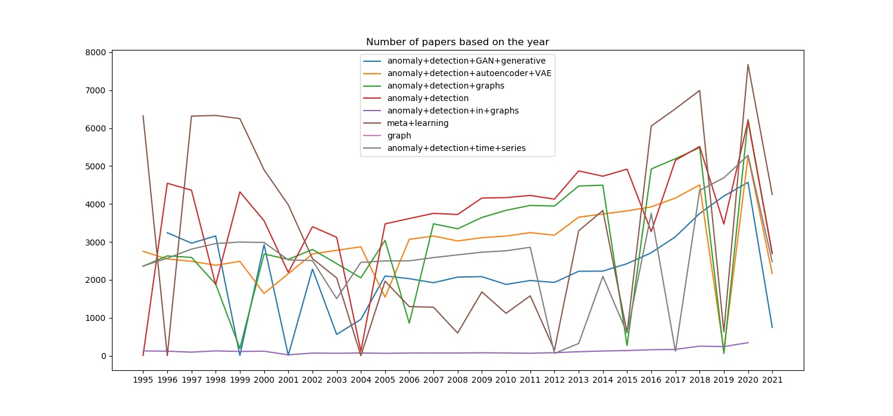
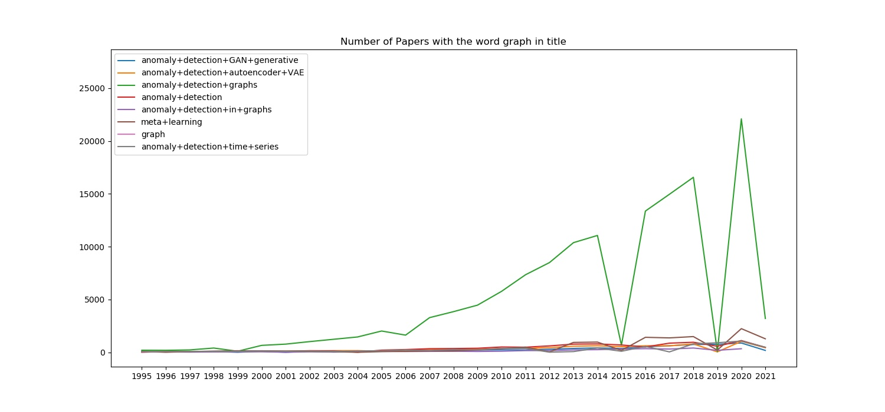
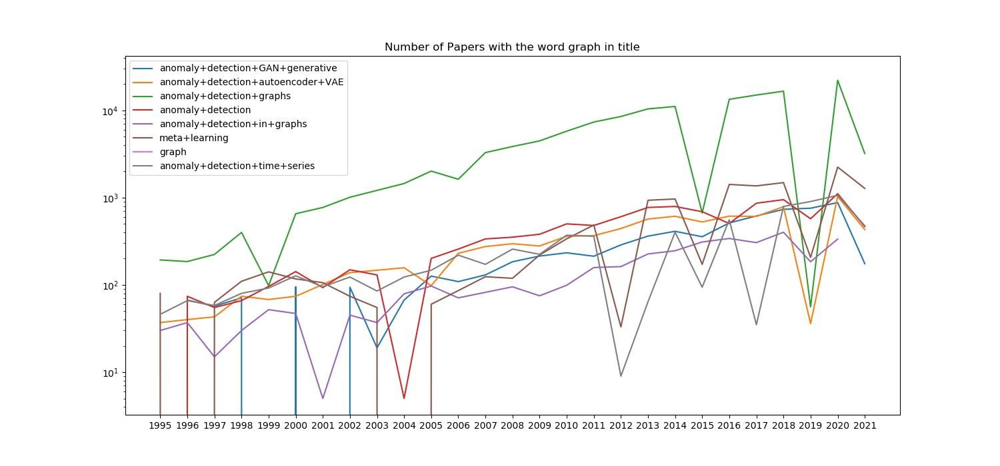

# arXiv-Analyzer

The arXiv-Analyzer uses the API of arXiv.org to fetch meta-information (e.g title, summary, data, authors) of scientific papers. 
The idea is to get first hints on the popularity of research papers over time. Below an analysis on the topic of anomaly detection can be seen :) 

# Research in the area of Anomaly Detection between 1995 and 2021

I made this repository to take a look at the current amount of papers in the area of anomaly detection.

The first plot shows the number of papers dependent on the specific year. Here, I checked for different search strings. The selection of the year is by adding `<year>` to the end of the query and then check that the publishing date is matching to the respective year.
In his graph, we can see that between the years 1995 and 2005 high amount of papers on the topic of anomaly detection were published on arXiv.org. Especially the topic of meta-learning shows high popularity before 2002. This topic is not directly related to the topic of anomaly detection, however, I assume it to be highly relevant in the area to be able to build anomaly detection systems that can adapt fastly to new datasets. 

From the year 2011, we see an increasing trend in all of the search queries. 

> Note: The query of `anomaly+detection+time+series` seems to be anomalous. I will check the correctness of this batch as soon as possible :) 

I am especially interested in anomaly detection systems on graph data. The wide area in which graph data is used (flow control, image data, networks, NLP, spatial analyses, etc.) gives a reason for the existence of anomaly detection on this data structure. Therefore I wanted to find out how the number of papers in this area is evolving. To do so, I plotted the count of the word "graph" in the summary and summed up these occurrences over the year.

The next plot shows these results Here, we can see clearly that the amount of "graph" in the summary is increasing over time in the query `anomaly+detection+graphs`. The result is therefore not surprising. However, it still shows that the popularity of anomaly detection on graphs or at least with graphs (e.g graph-based anomaly detection) is rising.

To be able to analyze the other queries as well, I plotted the data again on a log-scale:

In this plot, we can see the trend of graph related anomaly detection papers as well. 

With the last two graphs, we need to keep in mind that the number of the word 'graph' is summed up. Hence, articles with the word 'graph' 5 times in the summary will add a bias to the data. 

> Note: The shown data only gives hints on the trends in research. Due to the limitations of the arXis.org API, I was not able to get an overview of the total amount of papers on arXis.org. Hence, these trends can be biased by the increasing popularity of arXis.org. 

### Summary

Although the data resulting from this tool suffer under the heavy assumption that the number of publications on arXis.org is stable, it seems, that the popularity of the topic of anomaly detection is increasing. Especially the area of graph-related anomaly detection (graph-based or on graphs) seems to get more popular.
